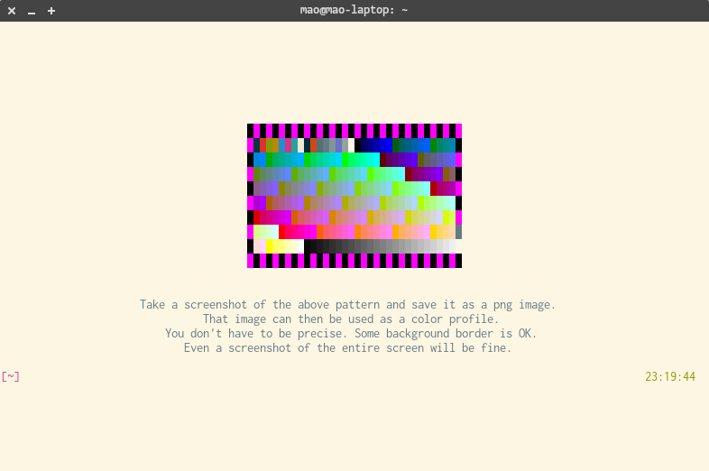

# `ts-player`: Flexible terminal recorder

## Building & Installing

### Via AUR:

[ts-player](https://aur.archlinux.org/packages/ts-player/)

### Build from source:

    go get -v -d
    make
    ./ts-player

## Features

- Jump around recordings instantly, even for hours/days long recordings.
- Produce recording files that are easy to parse randomly -- just like a video except you get text.
  - Clips, crops, text replacement, and other transformations are in principle easy to do. (TODO?)
  - [Format spec](./its.proto) (uses [protobuf](https://developers.google.com/protocol-buffers/))
- Index and encode recordings produced with the `script` command to this format.
- Corruption / crash recovery
- Bake color profile into recordings / play back recordings with any color profile of your choice. (I'm speaking of things like "xterm" or "solarized")
- Render recordings to video (arbitrary resolution / font) with `ffmpeg`

## Video demo

https://www.youtube.com/watch?v=-JARNcnfoa4

## Motivation

I record all my terminal activities, and I used to do this with `script`: \
 \
However, it is hard to replay and manage (can't easily jump around, produce GiBs of files). I knew of [asciinema](https://asciinema.org/) but a client-server setup just don't feel right. That's one motivation behind this project.

Another one is simply to learn how the Linux terminal works ([recommended article](http://www.linusakesson.net/programming/tty/)), and also, how to do concurrency with Go.

I might come up with yet another useless project when I decide to learn Rust.

## Things involved

- Parsing XTerm escape codes: [libvterm](http://www.leonerd.org.uk/code/libvterm/), [go binding](https://github.com/micromaomao/go-libvterm)
- Data serialization: [Protocol buffers](https://developers.google.com/protocol-buffers/)
- Producing video: piping data into `ffmpeg` command.

## Color profiles?

They can be generated for the current terminal simply by running `ts-player get-color-profile`. You get something like this:

Just take a screenshot of it **in png format**. The file can then be passed into the `-c` parameter.

Yes. `ts-player` scans the image for the black-purple color pattern.

## Planning TODOs

- JavaScript player
- Index recording content for fast text search
- Test Mac support & support Windows?
